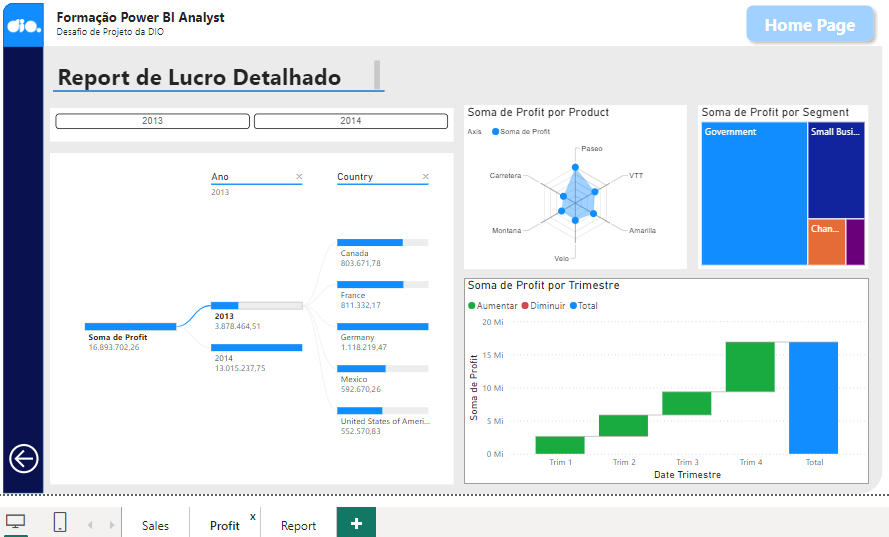

# Desafio de Projeto: Atualizando Relatório Financeiro com Foco na Experiência do Usuário

## Objetivo
Este projeto faz parte de um **Desafio de Projeto** para a formação de **Power BI Analyst** na DIO, com o objetivo de **modificar um relatório financeiro** criativo focando na **experiência do usuário**. O desafio inclui a aplicação de técnicas de **design** e **visualização de dados**, como:

- **Posicionamento**
- **Contraste**
- **Proporção áurea**
- **Segmentação dos dados**

## Estrutura do Relatório

O relatório é composto por **três páginas principais**, com uma interface otimizada para facilitar a navegação e a análise de dados. 

### 1. Sales Report (Relatório de Vendas)
- Exibe o total de vendas e unidades vendidas, segmentadas por diferentes categorias (Governo, Pequenos Negócios, Empresas, etc.).
- Inclui gráficos de barras e linhas para representar o desempenho das vendas por segmento e por período.
- A navegação é facilitada por botões para alternar entre diferentes visões (Segmento ou Produto) e a seleção de período ajustável.

### 2. Profit Report (Relatório de Lucro)
- Detalha o lucro total por país e por produto, além de mostrar a evolução do lucro ao longo dos trimestres.
- Gráficos de radar, barras e diagramas hierárquicos são utilizados para segmentar os lucros por produto e trimestre.
- A navegação por ano e país é possível por meio de filtros visuais.

### 3. Report de Vendas Detalhado
- Apresenta um **relatório detalhado de vendas**, mostrando a soma de vendas e o lucro ao longo do tempo.
- Inclui gráficos comparativos entre o **volume de vendas** e o **lucro bruto**, permitindo uma análise detalhada por período.
- Utiliza gráficos de linhas e barras empilhadas para facilitar a compreensão visual dos dados.

## Funcionalidades Implementadas

- **Botões de Navegabilidade**: Foram inseridos botões para facilitar a navegação entre as páginas e melhorar a experiência do usuário.
- **Personalização de Botões**: Os botões foram estilizados de acordo com a identidade visual do projeto e focados na interação fluida.
- **Segmentação de Dados**: Cada visualização é segmentada para fornecer insights específicos, como vendas por período, lucro por produto, e mais.
- **Design Responsivo**: O layout foi projetado levando em consideração **proporção áurea** e **contraste**, garantindo que a apresentação dos dados seja clara e agradável visualmente.

## Próximos Passos

- **Revisão e Melhoria**: A segunda página foi modificada de forma similar à primeira, com botões personalizados e um layout mais intuitivo.
- **Aperfeiçoamento dos Menus de Navegabilidade**: Menus foram criados em todas as páginas, permitindo que o usuário navegue de forma eficaz por todo o relatório.
- **Estilo Personalizado dos Botões**: O estilo dos botões foi feito livremente para manter a identidade visual criativa, mantendo o foco na usabilidade.

## Conclusão

O projeto atende ao objetivo de criar uma interface mais interativa e visualmente agradável para o usuário, com navegação simplificada e segmentação clara dos dados. A experiência do usuário foi aprimorada com a utilização de princípios de design que tornam a análise de dados mais eficiente.

---

